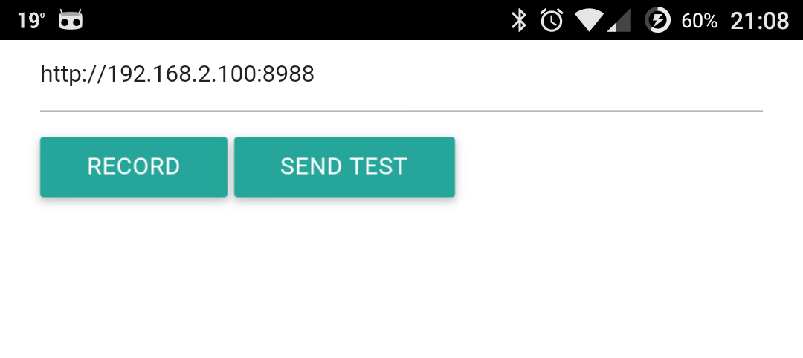

# Notification Webhook

Notification Webhook is an app for Android that allows you to
send notifications from your Android device to any web address
for processing notifications on your own apps or receive in your
smartwatch.

The companion app is written on top of the
[Apache Cordova framework](https://cordova.apache.org/).

## Plugins

* [Notification listener](https://github.com/coconauts/NotificationListener-cordova)
* [Background-mode](https://www.npmjs.com/package/cordova-plugin-background-mode)

## Allow the app access to your notifications

In order for the app to be able to pick up your phone notifications, you'll
need to explicitly grant it permissions.

Go to your phone settings, `Notifications`>`Notification access`, and tick
the Notification-webhook box.

## References

* [Apache Cordova cli](https://cordova.apache.org/docs/en/5.1.1/guide_cli_index.md.html#The%20Command-Line%20Interface)
* [Apache Cordova API](https://cordova.apache.org/docs/en/5.1.1/cordova_plugins_pluginapis.md.html#Plugin%20APIs)
* [Materialize CSS](http://materializecss.com/)
* [Cordova notification plugin](https://github.com/katzer/cordova-plugin-local-notifications)
* [Background mode](https://github.com/katzer/cordova-plugin-background-mode)
